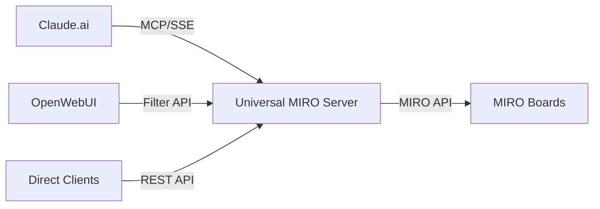

# 🌐 Universal MIRO Board MCP Server

[](LICENSE)
[](https://www.python.org)
[](https://modelcontextprotocol.io)

A production-ready, self-hosted server that bridges MIRO boards with AI assistants through dual protocols: MCP (Model Context Protocol) for Claude.ai and Filter API for OpenWebUI.

## ✨ Features

- **🤖 Dual Protocol Support**: Works with both Claude.ai (MCP/SSE) and OpenWebUI (Filter API)
- **📊 Full MIRO Integration**: Read, search, and analyze MIRO boards in real-time
- **🔍 Advanced Capabilities**: 
  - Full board content retrieval with filtering
  - Text search across all board items
  - Connection path tracing between items
  - Region-based content extraction
- **🔒 Production Ready**: SSL/HTTPS support, systemd service, nginx reverse proxy
- **📦 Easy Deployment**: Complete VPS setup guide with automated scripts

## 🚀 Quick Start

### Local Development
```bash
# Clone repository
git clone https://github.com/yourusername/miro-board-mcp
cd miro-board-mcp

# Install dependencies
pip install -r requirements.txt

# Configure environment
cp .env.example .env
# Edit .env and add your MIRO_ACCESS_TOKEN

# Run server
python miro_mcp_server.py
```

### Production Deployment
See [Complete VPS Setup Guide](docs/SETUP_GUIDE.md) for full production deployment with SSL.

## 📖 Documentation

- [Complete Setup Guide](docs/SETUP_GUIDE.md) - Full VPS deployment with nginx and SSL
- [Quick Start Guide](docs/QUICK_START.md) - Local development setup
- [API Reference](docs/API_REFERENCE.md) - All endpoints and parameters
- [Claude.ai Integration](docs/CLAUDE_INTEGRATION.md) - MCP setup for Claude
- [OpenWebUI Setup](docs/OPENWEBUI_SETUP.md) - Filter installation guide
- [Troubleshooting](docs/TROUBLESHOOTING.md) - Common issues and solutions

## 🔧 Configuration

Create a `.env` file with:
```env
# Required
MIRO_ACCESS_TOKEN=your_miro_access_token_here

# Optional
PORT=8001
LOG_LEVEL=INFO
```

Get your MIRO access token from: https://miro.com/app/settings/user-profile/apps

## 🎯 Usage Examples

### Claude.ai
```
Get all items and connections from MIRO board [XXXXXXXXXX]
Make a simple markdown table from it.
```

### OpenWebUI
```
Analyze Miro board [XXXXXXXXXX] and show all sticky notes
Search for 'customer' in board [board_id]
```

### Direct API
```bash
curl https://your-server.com/api/miro/board/YOUR_BOARD_ID
```

## 🏗️ Architecture



## 📊 Endpoints

| Endpoint | Protocol | Purpose | Client |
|----------|----------|---------|--------|
| `/sse` | MCP/SSE | Model Context Protocol | Claude.ai |
| `/filter/miro/analyze` | POST | Filter Protocol | OpenWebUI |
| `/api/miro/board/{id}` | REST | Direct API Access | Any |
| `/health` | GET | Health Check | Monitoring |

## 🤝 Contributing

Contributions are welcome! Please read our [Contributing Guide](CONTRIBUTING.md) for details.

## 📄 License

This project is licensed under the MIT License - see the [LICENSE](LICENSE) file for details.

## 🙏 Acknowledgments

- [Anthropic](https://anthropic.com) for the MCP protocol specification
- [MIRO](https://miro.com) for their excellent API
- [OpenWebUI](https://openwebui.com) community

## 💬 Support

- [Open an issue](https://github.com/alldevice/miro-board-mcp/issues) for bug reports
- [Start a discussion](https://github.com/alldevice/miro-board-mcp/discussions) for questions

---
Made with ❤️ for the AI community